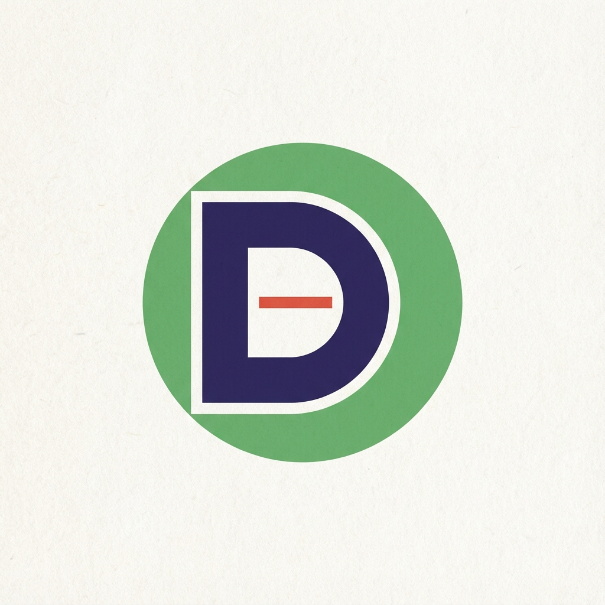

# Does This Feel Right? - Brand & Design Guide

> **Philosophy**: "The Zen Architect."
> A balanced tension between rigorous technical precision and deep human 'Ma' (negative space). The studio is a laboratory for **Agentic Systems Engineering**—building the opinionated "nervous system" for hybrid teams—but anchored in the disciplined simplicity: *"Does This Feel Right?"*

## 1. Voice & Tone
The brand voice bridges two distinct worlds: **The Engineer** and **The Philosopher**.

### The Dual Persona
- **The Engineer (Structure)**: Precise, systematic, authoritative. Speaks in protocols, architectures, and axioms.
    - *Keywords*: Orchestration, Telemetry, Forkable, Verifiable, High-Fidelity.
    - *Usage*: Documentation, System Status, Technical Essays.
- **The Philosopher (Soul)**: Introspective, vulnerable, questioning. Speaks in feelings, connections, and human truths.
    - *Keywords*: Grief, Connection, Veil, Resonance, Witnessed.
    - *Usage*: "Inner Work" essays, strategic purpose, the "Why".

**Tone Guidelines:**
- **Inquisitive**: Always asking the core question. Not purely declarative, but searching.
- **Zen Precision**: Minimalist, high-resolution information presented with intentional negative space (Ma).
- **Transparent**: We "work with the garage door open." Logs, errors, and "retired moves" are public.
- **Opinionated**: We are not a generic agency. We are an "Opinionated OS" with a specific worldview.

## 2. Lexicon & Core Concepts

| Term | Definition |
|------|------------|
| **Studio OS** | The operating system of the organization; the sum of agents, workflows, and culture. |
| **Agentic Systems Engineering (ASE)** | The formal discipline of building the "nervous system" for AI-native teams. |
| **Frontier Team** | A hybrid team structure composed of humans and specialized agents (Architect, Operator, Librarian). |
| **Opinionated OS** | A system designed with specific "taste" and governance, opposed to generic, unopinionated tools. |
| **Felt Right Index** | A custom system metric that quantifies alignment and human satisfaction (not just efficiency). |
| **The Stack vs. The Signal** | The tension between the plumbing (infrastructure) and the narrative (purpose). |
| **Open Core** | The business model: The core OS is free/observable; the advisory/customization is paid. |

## 3. Visual Identity

### Color Palette
The color system is built on "Deep Space Slate" backgrounds and "Studio Green" accents, creating a calm, high-contrast environment optimized for long-form reading and deep work.

| Token | Hex | Role |
|-------|-----|------|
| **Backgrounds** | | |
| `bg-primary` | `#020202` | Main page background (limitless void) |
| `bg-secondary` | `#050505` | Sidebar, Cards, UI Containers |
| `bg-tertiary` | `#0A0A0A` | Inputs, Active States, Borders |
| **Typography** | | |
| `text-primary` | `#66B56E` | Headings, Strong Signals (Studio Green Harmony) |
| `text-secondary` | `#C9CEC9` | Body Text, Paragraphs (Muted Grey-Green) |
| `text-tertiary` | `#8A908C` | Meta data, timestamps (Soft Functional Grey) |
| `text-pure` | `#FFFFFF` | Critical contrasts, specific modes |
| **Accents** | | |
| `accent-primary` | `#66B56E` | Links, Buttons, Active Indicators |
| `accent-hover` | `#7BC583` | Interactive states |
| `accent-subtle` | `rgba(102, 181, 110, 0.08)` | Background highlights, badges |

### Typography
A disciplined pairing of Swiss-style sans-serif for clarity and coding monospace for technical precision.

- **Display & Body**: `Inter` (Weights: 300, 400, 500, 600, 700, 800, 900)
- **Monospace**: `JetBrains Mono` or `Fira Code`

**Type Scale (Dashboard Optimized):**
- `6xl`: 72px
- `5xl`: 60px (h1)
- `4xl`: 48px (h2)
- `3xl`: 36px
- `2xl`: 30px (h3)
- `xl`: 24px
- `lg`: 20px
- `base`: 16px
- `sm`: 14px
- `xs`: 12px

### Official Asset

| Asset | Preview | Use Case |
|-------|---------|----------|
| **The Mon Crest** |  | Unified brand identity: logos, profile, and seals |

### Logo Construction
 **The Japanese Minimalist "D"**: A geometric mon crest.
```svg
<svg viewBox="0 0 24 24" fill="none" stroke="#66B56E" stroke-width="2" stroke-linecap="round" stroke-linejoin="round">
    <path d="M4 4h8a8 8 0 0 1 0 16H4V4z" />
    <circle cx="12" cy="12" r="2" />
</svg>
```

## 4. Design System

### Spacing & Layout
A geometric spacing scale ensuring rhythm and alignment.
- Units: 4px, 8px, 12px, 16px, 24px, 32px, 48px, 64px, 96px, 128px.
- Sidebar Width: 72px.
- Max Containers: `sm` (640px), `md` (800px), `lg` (1024px), `xl` (1400px).

### Shape & Form
"Softened Industrial" - Engineered but approachable.
- **Radius**:
    - `sm`: 8px (Buttons, Items)
    - `md`: 16px (Cards)
    - `lg`: 24px (Modals)
- **Borders**: Thin, subtle borders (`1px solid var(--border-subtle)`) define structure without clutter.

### UI Components

**Badges**
Small, pill-shaped indicators for status or categories.
- `badge--canon`: Accent background, accent text.
- `badge--muted`: Transparent background, tertiary text.

**Navigation**
- **Sidebar**: Fixed, icon-based navigation on the left.
- **Mobile Drawer**: Off-canvas slide-out menu with "Glass" backdrop.

## 5. Motion & Interaction
The interface feels "alive" through subtle micro-interactions.

- **FadeUp**: Elements smoothly rise into view (`translateY(20px)` -> `0`).
- **Float**: Gentle hovering for non-interactive visual elements.
- **Pulse Glow**: Soft shadow pulsations for attention-grabbing elements.
- **Staggered Reveals**: List items fade in sequentially (50ms delay steps).
- **Hover States**:
    - Links: Color transition + Bottom border fade-in.
    - Buttons: Scale (1.05x) + Glow (`box-shadow`).
    - Sidebar Icons: Scale (1.15x).
