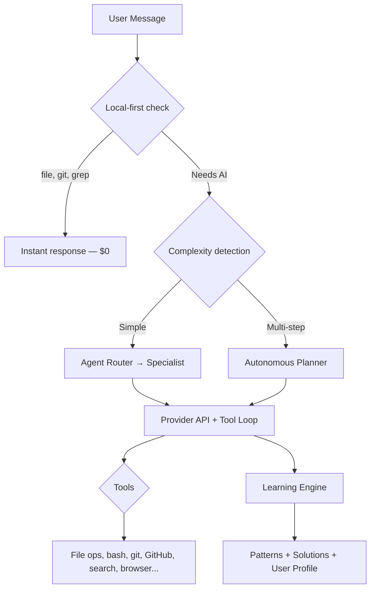

<p align="center">
  <strong>K:BOT</strong><br>
  Open-source terminal AI agent. 37 specialists, 85 tools, 19 providers, local-first.
</p>

<p align="center">
  <a href="https://www.npmjs.com/package/@kernel.chat/kbot"></a>
  <a href="https://www.npmjs.com/package/@kernel.chat/kbot"></a>
  <a href="https://github.com/isaacsight/kernel/blob/main/LICENSE"></a>
  <a href="https://kernel.chat"></a>
</p>

```bash
npx @kernel.chat/kbot
```

## Why K:BOT?

Most terminal AI agents lock you into one provider, one model, one way of working. K:BOT doesn't.

- **19 providers, zero lock-in** — Claude, GPT, Gemini, Mistral, Grok, DeepSeek, Groq, SambaNova, Cerebras, OpenRouter, and more. Switch with one command.
- **Runs fully offline** — Ollama, LM Studio, or Jan for $0 local AI. No data leaves your machine.
- **Learns your patterns** — remembers what worked, adapts to your coding style, gets faster over time.
- **37 specialist agents** — auto-routes your request to the right expert (coder, researcher, debugger, physicist, economist, and 32 more).
- **MCP server built in** — plug kbot into Claude Code, Cursor, VS Code, Zed, or Neovim as a tool provider.

### How it compares

| | K:BOT | Claude Code | Aider | OpenCode |
|---|---|---|---|---|
| AI providers | 14 | 1 | 6 | 75+ |
| Specialist agents | 37 | 0 | 0 | 0 |
| Learning engine | Yes | No | No | No |
| Offline mode | Ollama + OpenClaw | No | Ollama | Ollama |
| MCP server | Yes | N/A | No | No |
| Web companion | kernel.chat | No | No | No |
| Open source | MIT | Source available | Apache 2.0 | MIT |
| Cost | BYOK / $0 local | $20+/mo | BYOK | BYOK |

## Quick Start

```bash
# Install globally
npm install -g @kernel.chat/kbot

# Or run directly (no install)
npx @kernel.chat/kbot

# Or use the install script
curl -fsSL https://kernel.chat/install.sh | bash
```

```bash
# Interactive mode
kbot

# One-shot
kbot "explain this codebase"
kbot "fix the auth bug in src/auth.ts"
kbot "create a Dockerfile for this project"

# Pipe mode (for scripting)
kbot -p "generate a migration for user roles" > migration.sql

# Use local models (free, no API key)
kbot ollama

# Set up your API key
kbot auth
```

## Specialists

K:BOT auto-routes to the right agent for each task. Or pick one manually with `--agent <name>`.

**Core**: kernel, researcher, coder, writer, analyst
**Extended**: aesthete, guardian, curator, strategist, infrastructure, quant, investigator, oracle, chronist, sage, communicator, adapter
**Domain**: physicist, mathematician, biologist, economist, psychologist, engineer, medic, linguist, ethicist, educator, diplomat
**Systems**: session, scholar, auditor, benchmarker, synthesizer, debugger

## Features

- **60+ Tools** — File read/write, bash, git, GitHub, web search, Jupyter notebooks, Docker sandbox, browser automation, background tasks, MCP client
- **Local-First** — Simple tasks (file reads, git, grep) run locally without an API call ($0)
- **Learning Engine** — Caches successful patterns, solutions, and your preferences
- **Mimic Matrix** — Code like Claude Code, Cursor, Copilot, or framework experts (Next.js, React, Rust, Python)
- **Autonomous Planner** — Multi-step tasks get broken into plans, executed, and verified
- **Subagent System** — Spawn parallel workers for research, coding, and analysis
- **Sessions** — Save, resume, and share conversations
- **Hooks & Plugins** — Pre/post tool hooks and custom plugin system
- **IDE Integration** — MCP server for VS Code, Cursor, Windsurf, Zed, Neovim

## Slash Commands

| Command | What it does |
|---------|-------------|
| `/agent <name>` | Switch specialist agent |
| `/model <name>` | Switch AI model |
| `/mimic <profile>` | Code like Claude Code, Cursor, Next.js, etc. |
| `/plan <task>` | Autonomous plan + execute mode |
| `/save` | Save your conversation |
| `/resume <id>` | Pick up where you left off |
| `/ollama [model]` | Switch to local models |
| `/thinking` | Toggle extended thinking |
| `/compact` | Compress conversation history |
| `/matrix` | Manage custom agents |
| `/plugins` | Manage plugins |
| `/help` | Full command list |

## Providers

| Provider | Cost | How to set up |
|----------|------|---------------|
| Anthropic (Claude) | $3-15/M tokens | `ANTHROPIC_API_KEY` |
| OpenAI (GPT) | $2.50-10/M tokens | `OPENAI_API_KEY` |
| Google (Gemini) | $0.15-0.60/M tokens | `GOOGLE_API_KEY` |
| Mistral | $0.25-2/M tokens | `MISTRAL_API_KEY` |
| xAI (Grok) | $3-15/M tokens | `XAI_API_KEY` |
| DeepSeek | $0.14-2.19/M tokens | `DEEPSEEK_API_KEY` |
| Groq | $0.05-0.27/M tokens | `GROQ_API_KEY` |
| Together AI | $0.20-1.20/M tokens | `TOGETHER_API_KEY` |
| Fireworks | $0.20-0.90/M tokens | `FIREWORKS_API_KEY` |
| Perplexity | $0.20-1.00/M tokens | `PERPLEXITY_API_KEY` |
| Cohere | $0.50-15/M tokens | `COHERE_API_KEY` |
| NVIDIA NIM | $0.10-0.40/M tokens | `NVIDIA_API_KEY` |
| Ollama (Local) | **Free** | `ollama serve` |
| OpenClaw (Local) | **Free** | `openclaw-cmd start` |

Set any provider's env var and K:BOT auto-detects it. Or run `kbot auth` for interactive setup.

## Architecture



## MCP Server

Use kbot as a tool provider inside any MCP-compatible IDE:

```json
{
  "mcp": {
    "servers": {
      "kbot": { "command": "kbot", "args": ["ide", "mcp"] }
    }
  }
}
```

14 tools exposed: `kbot_chat`, `kbot_plan`, `kbot_bash`, `kbot_read_file`, `kbot_edit_file`, `kbot_write_file`, `kbot_search`, `kbot_github`, `kbot_glob`, `kbot_grep`, `kbot_agent`, `kbot_remember`, `kbot_diagnostics`, `kbot_status`.

## HTTP Server

```bash
kbot serve --port 7437 --token mysecret
```

REST API exposing all 85 tools. Any LLM or automation pipeline that can make HTTP calls can use kbot as a backend.

## Security

- API keys encrypted at rest (AES-256-CBC)
- Config file restricted to owner (chmod 600)
- Destructive operations require confirmation
- Bash tool blocks dangerous commands (rm -rf /, fork bombs, etc.)
- Tool execution timeout (5 min default)
- Result truncation prevents memory exhaustion (50KB)

## Development

```bash
cd packages/kbot
npm install
npm run dev          # Run in dev mode (tsx)
npm run build        # Compile TypeScript
npm run test         # Run tests
npm run typecheck    # Type-check only
```

## Web Companion — kernel.chat

K:BOT has a web companion at [kernel.chat](https://kernel.chat) — same 37 agents, persistent memory, and a visual interface. Free to use (20 messages/day).

The web app source lives in `src/` with a Supabase backend in `supabase/`.

## Community

- **Web**: [kernel.chat](https://kernel.chat)
- **npm**: [@kernel.chat/kbot](https://www.npmjs.com/package/@kernel.chat/kbot)
- **GitHub**: [isaacsight/kernel](https://github.com/isaacsight/kernel)
- **Issues**: [Report a bug](https://github.com/isaacsight/kernel/issues)

## License

[MIT](LICENSE) — [kernel.chat group](https://kernel.chat)
