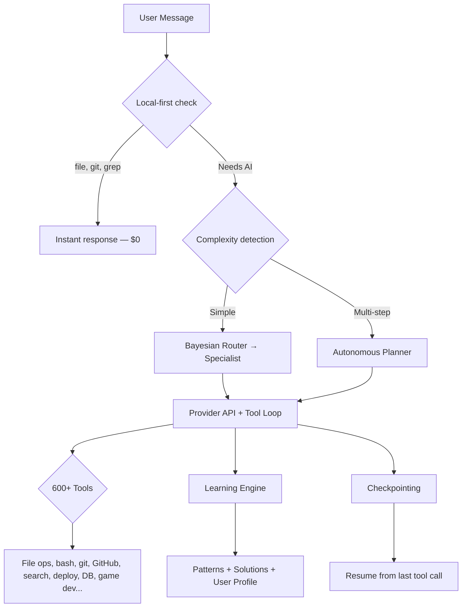

<p align="center">
  <strong>kbot</strong><br>
  Open-source terminal AI agent. 35 agents. 600+ tools. 20 providers. Science, finance, security, and more.
</p>

<p align="center">
  
</p>

<p align="center">
  <a href="https://github.com/isaacsight/kernel/actions/workflows/ci.yml"></a>
  <a href="https://www.npmjs.com/package/@kernel.chat/kbot"></a>
  <a href="https://www.npmjs.com/package/@kernel.chat/kbot"></a>
  <a href="https://github.com/isaacsight/kernel/blob/main/LICENSE"></a>
  <a href="https://kernel.chat"></a>
  <a href="https://discord.gg/kdMauM9abG"></a>
  <a href="https://glama.ai/mcp/servers/isaacsight/kernel"></a>
</p>

> If kbot is useful to you, consider [starring the repo](https://github.com/isaacsight/kernel) — it helps others discover the project.

```bash
npm install -g @kernel.chat/kbot
```

## Why kbot?

Most terminal AI agents lock you into one provider, one model, one way of working. kbot doesn't.

- **20 providers, zero lock-in** — Claude, GPT, Gemini, Grok, DeepSeek, Groq, Mistral, SambaNova, Cerebras, OpenRouter, and more. Switch with one command.
- **Runs fully offline** — Embedded llama.cpp, Ollama, LM Studio, or Jan. $0, fully private.
- **Learns your patterns** — Bayesian skill ratings + pattern extraction. Gets faster over time.
- **35 specialist agents** — auto-routes your request to the right expert (coder, researcher, writer, guardian, quant, and 30 more).
- **600+ tools** — files, bash, git, GitHub, web search, deploy, database, game dev, VFX, research, science, finance, security, and more.
- **Programmatic SDK** — use kbot as a library in your own apps.
- **MCP server built in** — plug kbot into Claude Code, Cursor, VS Code, Zed, or Neovim as a tool provider.

### How it compares

| | kbot | Claude Code | Codex CLI | Aider | OpenCode |
|---|---|---|---|---|---|
| AI providers | 20 | 1 | 1 | 6 | 75+ |
| Specialist agents | 35 | 0 | 0 | 0 | 0 |
| Built-in tools | 600+ | ~20 | ~15 | ~10 | ~15 |
| Science tools | 114 | 0 | 0 | 0 | 0 |
| Learning engine | Yes | No | No | No | No |
| Offline mode | Embedded + Ollama | No | No | Ollama | Ollama |
| SDK | Yes | No | Yes | No | No |
| MCP server | Yes | N/A | No | No | No |
| Web companion | kernel.chat | No | No | No | No |
| Open source | MIT | Source available | Apache 2.0 | Apache 2.0 | MIT |
| Cost | BYOK / $0 local | $20+/mo | BYOK | BYOK | BYOK |

## Quick Start

```bash
# Install globally
npm install -g @kernel.chat/kbot

# Or run directly (no install)
npx @kernel.chat/kbot

# Or use the install script (auto-installs Node.js if needed)
curl -fsSL https://kernel.chat/install.sh | bash
```

```bash
# Interactive mode
kbot

# One-shot
kbot "explain this codebase"
kbot "fix the auth bug in src/auth.ts"
kbot "create a Dockerfile for this project"

# Pipe mode (for scripting)
kbot -p "generate a migration for user roles" > migration.sql

# Use local models (free, no API key)
kbot local

# Set up your API key
kbot auth
```

## Specialists

kbot auto-routes to the right agent for each task. Or pick one with `--agent <name>`.

| | Agents |
|---|---|
| **Core** | kernel, researcher, coder, writer, analyst |
| **Extended** | aesthete, guardian, curator, strategist |
| **Domain** | infrastructure, quant, investigator, oracle, chronist, sage, communicator, adapter |
| **Presets** | claude-code, cursor, copilot, creative, developer |

## 600+ Tools

| Category | Examples |
|----------|---------|
| **Files & Code** | read, write, glob, grep, lint, format, type-check |
| **Shell** | bash, parallel execute, background tasks |
| **Git & GitHub** | commit, diff, PR, issues, code search |
| **Web** | search, fetch, browser automation, browser agent |
| **Research** | arXiv, Semantic Scholar, HuggingFace, NASA, DOI |
| **Data** | CSV read/query/write, transforms, reports, invoices |
| **Quality** | lint (ESLint/Biome/Clippy), test (Vitest/Jest/pytest), deps audit, formatting |
| **Deploy** | Vercel, Netlify, Cloudflare Workers/Pages, Fly.io, Railway |
| **Database** | Postgres, MySQL, SQLite queries, Prisma, ER diagrams, seed data |
| **Containers** | Docker build/run/compose, Terraform |
| **Creative** | p5.js generative art, GLSL shaders, SVG patterns, design variants |
| **VFX** | GLSL shaders, FFmpeg, ImageMagick, Blender, procedural textures |
| **Game Dev** | 16 tools for Godot, Unity, Unreal, Bevy, Phaser, Three.js, PlayCanvas, Defold |
| **Training** | dataset prep, fine-tuning, evaluation, model export |
| **Social** | post to X, LinkedIn, Bluesky, Mastodon — single posts and threads |
| **Sandbox** | Docker sandboxes, E2B cloud sandboxes, isolated code execution |
| **Notebooks** | Jupyter read/edit/insert/delete cells |
| **Build Matrix** | cross-platform builds — mobile, desktop, WASM, embedded, server |
| **LSP** | goto definition, find references, hover, rename, diagnostics |
| **Memory** | persistent memory save/search/update across sessions |
| **MCP** | marketplace search/install, 20 bundled servers |
| **IDE** | MCP server, ACP server, LSP bridge |
| **Forge** | create tools at runtime, publish to registry, install from registry |
| **Meta** | subagents, worktrees, planner, sessions, checkpoints, self-eval |
| **Science & Math** | symbolic compute, matrix ops, FFT, ODEs, probability, optimization, graph theory, OEIS |
| **Physics** | orbital mechanics, circuits, signal processing, particles (PDG), relativity, quantum simulator, beam analysis, fluid dynamics |
| **Chemistry** | PubChem compounds, reactions, periodic table (118 elements), spectroscopy, stoichiometry, thermodynamics |
| **Biology** | PubMed, gene lookup, protein/PDB, BLAST, drug/ChEMBL, pathways, taxonomy, clinical trials |
| **Earth & Climate** | earthquakes/USGS, climate/NOAA, satellite imagery, geology, ocean, air quality, volcanoes, water resources |
| **Neuroscience** | brain atlas, EEG analysis, cognitive models, neural simulation, connectome, psychophysics |
| **Social Science** | psychometrics, game theory, econometrics, social network analysis, survey design, voting systems |
| **Humanities** | corpus analysis, formal logic, argument mapping, ethics frameworks, historical timelines, stylometry |
| **Health & Epidemiology** | SIR/SEIR models, epidemiology calculations, disease surveillance, nutrition, vaccination modeling |
| **Finance** | market data, technical analysis, paper trading, DeFi yields, wallet & swaps, stock screener, sentiment |
| **Cybersecurity** | dep_audit, secret_scan, ssl_check, headers_check, cve_lookup, port_scan, owasp_check |
| **Self-Defense** | memory HMAC, prompt injection detection, knowledge sanitization, forge verification, anomaly detection |

## 20 Providers

| Provider | Cost | Local? |
|----------|------|--------|
| **Embedded (llama.cpp)** | **Free** | Yes |
| **Ollama** | **Free** | Yes |
| **LM Studio** | **Free** | Yes |
| **Jan** | **Free** | Yes |
| DeepSeek | $0.27/M in | Cloud |
| SambaNova | $0.50/M in | Cloud |
| Cerebras | $0.60/M in | Cloud |
| Groq | $0.59/M in | Cloud |
| NVIDIA NIM | $0.80/M in | Cloud |
| Together AI | $0.88/M in | Cloud |
| Fireworks AI | $0.90/M in | Cloud |
| Google (Gemini) | $1.25/M in | Cloud |
| Mistral | $2.00/M in | Cloud |
| OpenAI (GPT) | $2.00/M in | Cloud |
| Cohere | $2.50/M in | Cloud |
| Anthropic (Claude) | $3.00/M in | Cloud |
| xAI (Grok) | $3.00/M in | Cloud |
| Perplexity | $3.00/M in | Cloud |
| OpenRouter | varies | Cloud |
| kbot local | **Free** | Yes |

Set any provider's env var and kbot auto-detects it. Or run `kbot auth` for interactive setup.

## SDK

```typescript
import { agent, tools, providers } from '@kernel.chat/kbot'

const result = await agent.run("fix the auth bug", { agent: 'coder' })
console.log(result.content)

for await (const event of agent.stream("explain this code")) {
  if (event.type === 'content_delta') process.stdout.write(event.text)
}
```

## Architecture



## MCP Server

[](https://glama.ai/mcp/servers/isaacsight/kernel)

Use kbot as a tool provider inside any MCP-compatible IDE:

```json
{
  "mcp": {
    "servers": {
      "kbot": { "command": "kbot", "args": ["ide", "mcp"] }
    }
  }
}
```

Or run via Docker:

```bash
docker run -i --rm kernelchat/kbot ide mcp
```

Works with Claude Code, Cursor, VS Code, Windsurf, Zed, Neovim.

## Commands

| Command | What it does |
|---------|-------------|
| `kbot` | Interactive REPL |
| `kbot "prompt"` | One-shot execution |
| `kbot auth` | Configure API key |
| `kbot local` | Use local AI (Ollama, embedded, LM Studio, Jan) |
| `kbot serve` | Start HTTP REST + SSE streaming server |
| `kbot audit <repo>` | Security + quality audit of any GitHub repo |
| `kbot contribute <repo>` | Find good-first-issues and quick wins |
| `kbot share` | Share conversation as GitHub Gist |
| `kbot pair` | File watcher with auto-analysis |
| `kbot team` | Multi-agent TCP collaboration |
| `kbot record` | Terminal session recording (SVG, GIF, asciicast) |
| `kbot voice` | Text-to-speech output mode |
| `kbot watch` | Real-time file analysis on change |
| `kbot bootstrap` | Outer-loop project optimizer (visibility scoring) |
| `kbot plugins` | Search, install, update community plugins |
| `kbot models` | List, pull, remove, catalog local models |
| `kbot changelog` | Generate changelog from git history |
| `kbot completions` | Shell completions (bash, zsh, fish) |
| `kbot cloud` | Sync learning data to kernel.chat |
| `kbot ide mcp` | Start MCP server for IDEs |
| `kbot doctor` | 10-point health check |

### Power-User Flags

```bash
kbot --architect "design the auth system"    # Architecture mode — plan before code
kbot --thinking "solve this hard problem"    # Extended reasoning with thinking budget
kbot --self-eval "write a parser"            # Self-evaluation loop — scores and retries
kbot --computer-use "fill out this form"     # Computer use — controls mouse and keyboard
kbot -p "query" > output.txt                 # Pipe mode — clean output for scripting
```

## Security

- API keys encrypted at rest (AES-256-CBC)
- Destructive operations require confirmation
- Shell commands sandboxed with blocklist
- Tool execution timeout (5 min) with middleware pipeline
- Config files restricted to owner (chmod 600)
- 0 P0/P1 security issues (audited March 2026)

## Development

```bash
cd packages/kbot
npm install
npm run dev          # Run in dev mode
npm run build        # Compile TypeScript
npm run test         # Run tests (vitest)
```

## Web Companion — kernel.chat

kbot has a web companion at [kernel.chat](https://kernel.chat) — same agents, persistent memory, and a visual interface. Free to use (20 messages/day).

## Community

- **Web**: [kernel.chat](https://kernel.chat)
- **npm**: [@kernel.chat/kbot](https://www.npmjs.com/package/@kernel.chat/kbot)
- **Discord**: [discord.gg/kdMauM9abG](https://discord.gg/kdMauM9abG)
- **GitHub**: [isaacsight/kernel](https://github.com/isaacsight/kernel)
- **Issues**: [Report a bug](https://github.com/isaacsight/kernel/issues)

## License

[MIT](LICENSE) — [kernel.chat group](https://kernel.chat)
