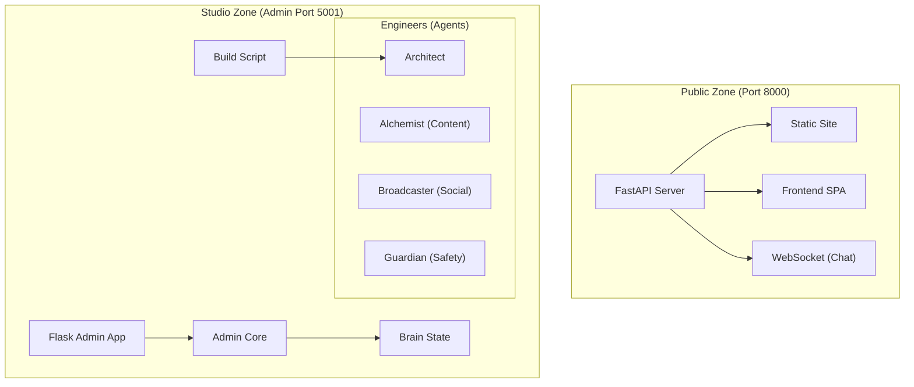

# Does This Feel Right?

A modern, static blog built with Python featuring AI-powered content generation, terminal-based admin interface, and automated deployment.

[](https://github.com/isaachernandez/blog-design/actions)
[](https://github.com/isaachernandez/blog-design/actions)

🌐 **Live Site**: [doesthisfeelright.com](https://www.doesthisfeelright.com)

## Features

- 📝 **Static Site Generation**: Custom Python build system for blazing-fast sites
- 🤖 **AI Content Generation**: Integrated Gemini, OpenAI, and Anthropic APIs
- 💻 **TUI Admin Dashboard**: Beautiful terminal interface with Textual
- 🔒 **Security First**: Automated security scanning and secrets management
- ✅ **Tested**: Comprehensive test suite with >80% coverage
- 🚀 **Automated Deployment**: GitHub Actions CI/CD to GitHub Pages
- 🎨 **SEO Optimized**: JSON-LD, sitemaps, RSS feeds, and meta tags


## System Architecture

The "IanSight" System operates as a dual-layer architecture: a **Public Presence** (FastAPI) and a **Private Studio** (Flask Admin).

[View Live System Architecture](https://www.doesthisfeelright.com/architecture.html)



## Tech Stack


**Core:**
- Python 3.9+
- Custom markdown-to-HTML converter
- Frontmatter-based content management

**AI Integration:**
- Google Gemini API
- OpenAI GPT
- Anthropic Claude

**Admin Interface:**
- Textual (Terminal UI)
- Supabase (optional backend)

**Quality & Security:**
- pytest (testing)
- Black (formatting)
- Ruff (linting)
- Bandit (security scanning)
- pre-commit hooks

## Quick Start

### Prerequisites

- Python 3.9 or later
- Git
- API keys for AI providers (Gemini recommended)

### Setup

```bash
# Clone the repository
git clone https://github.com/isaachernandez/blog-design.git
cd blog-design

# Run automated setup
bash scripts/setup_dev.sh

# Activate virtual environment
source .venv/bin/activate

# Edit .env and add your API keys
nano .env
```

### Build & Run

```bash
# Build the static site
python build.py

# Serve locally
python -m http.server 8000 --directory docs
# Visit http://localhost:8000

78: # Or run the admin TUI
79: python3 admin/tui.py
80: ```
81:
82: ### Run n8n locally
83: ```bash
84: ./admin/start_n8n.sh
85: ```
86:
87: ### Test n8n startup
88: ```bash
89: ./admin/test_n8n.sh
90: ```


## Development Workflow

### 1. Setup Development Environment

```bash
# One-time setup
bash scripts/setup_dev.sh
source .venv/bin/activate
```

### 2. Make Changes

Edit files, create content, modify code...

### 3. Run Quality Checks

```bash
# Auto-format code
black .

# Lint code
ruff check . --fix

# Type checking
mypy build.py admin/*.py

# Run tests
pytest

# Or use the script
bash scripts/run_tests.sh
```

### 4. Security Scan

```bash
# Run comprehensive security checks
bash scripts/security_scan.sh
```

### 5. Commit

Pre-commit hooks will automatically run formatting, linting, and security checks:

```bash
git add .
git commit -m "Your commit message"
git push
```

## Testing

```bash
# Run all tests
pytest

# With coverage report
pytest --cov=. --cov-report=html

# Run specific test file
pytest tests/test_build.py

# Or use the convenience script
bash scripts/run_tests.sh
```

## Project Structure

```
blog-design/
├── admin/                 # TUI admin application
│   ├── core.py           # Core admin functionality
│   └── tui.py            # Textual UI
├── content/              # Markdown blog posts
├── templates/            # HTML templates
├── static/               # CSS, JS, images
├── docs/                 # Built site (output)
├── tests/                # Test suite
├── scripts/              # Automation scripts
├── build.py              # Static site generator
├── requirements.txt      # Production dependencies
├── requirements-dev.txt  # Development dependencies
├── pyproject.toml        # Tool configuration
└── .pre-commit-config.yaml  # Pre-commit hooks
```

## Creating Content

### Via TUI (Recommended)

```bash
python3 admin/tui.py
# Press 'n' for new post
# Press 'g' for AI-generated post
# Press 'p' to publish via Git
```

### Manual Creation

Create a markdown file in `content/`:

```markdown
---
title: My New Post
date: 2024-01-01
category: Technology
tags: python, ai, web
excerpt: A brief description
read_time: 5 min read
---

Your content here...
```

Then rebuild:

```bash
python build.py
```

## AI-Assisted Development

This project is optimized for use with AI coding tools:

### With Cursor

```bash
# Open project in Cursor
cursor .

# Use Cmd+K to chat with AI about code
# Ask it to help implement features, fix bugs, or refactor
```

### With Aider

```bash
  # Use the existing Aider workflow
# See .agent/workflows/aider-quick-start.md

aider build.py admin/core.py
# Chat with AI to make changes
```

**Best Practices:**
- Provide clear, specific instructions
- Reference the 2025 dev guide in artifacts
- Ask AI to follow the style in `pyproject.toml`
- Request tests for new features

## Deployment
- Direct link to read
- Beautiful minimal design

Last updated: 2025-11-21
