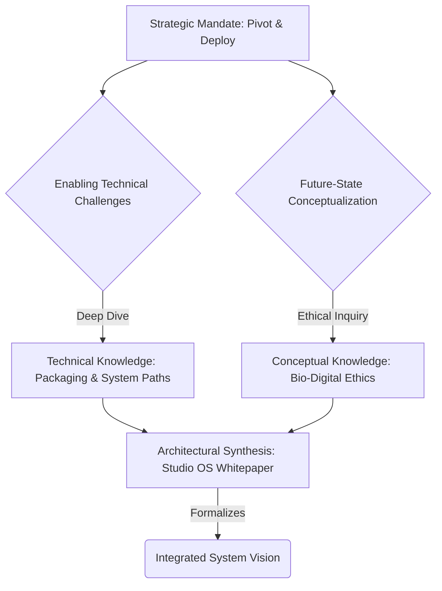

---

### Studio Product Deliverable

**Project Title:** **Aetherial Codex V1.1 - Strategic & Operational Synthesis**
**Audit Reference:** Reporter Protocol v1.0 - Browser Session Audit
**Audit Date:** 2025-12-26

---

### 1. The Executive Summary

*   **Visionary System Architecture:** Strategic focus on conceptualizing and documenting advanced, speculative systems (Studio OS, Antigravity, Bio-Digital Ethics) is primary.
*   **Decisive Project Velocity:** Key strategic decisions, including a major pivot and v1.0 deployment, indicate high momentum and clear project direction.
*   **Foundational Technical Enablement:** Significant effort is dedicated to resolving deep-level technical challenges critical for system deployment and operationalization.

---

### 2. Strategic Recommendations

1.  **Contextualize Foundational Work:** Institute a brief pre-task intent declaration for deep technical dives (e.g., `py2app` troubleshooting) to explicitly link the activity to higher-level project components or strategic objectives. This enhances traceability and future-state audit clarity.
2.  **Optimize Cognitive Sprints:** Implement focused "deep work" blocks for complex research initiatives (e.g., LLM impact) or known technical 'rabbit holes,' isolating them from high-velocity strategic decision cycles. This aims to mitigate cognitive load and improve topic mastery.
3.  **Streamline Role Transition Protocol:** Adopt a concise 'phase gate' or 'role transition' prompt before commencing distinct workstreams (e.g., shifting from ethical research to architectural documentation). This reinforces current intent and reduces mental friction from rapid context switching.

---

### 3. Visual Framing: Knowledge Flow Trajectory

**Interpretation:** The flow illustrates a robust cycle initiated by strategic directives, branching into both foundational technical problem-solving and abstract future-state conceptualization. These diverse knowledge streams converge, ultimately informing and formalizing a grand, integrated system vision.

---

### 4. Verdict: Felt Right Index (FRI)

**88%**

**Assessment:** The session demonstrates exceptional strategic foresight and execution drive. While navigating complex temporal shifts and technical deep dives, the overarching intent remains highly coherent and purposeful. The identified frictions are primarily operational, indicating opportunities for process refinement rather than fundamental misalignment. The trajectory is strong, progressive, and clearly aligned with ambitious, visionary objectives.