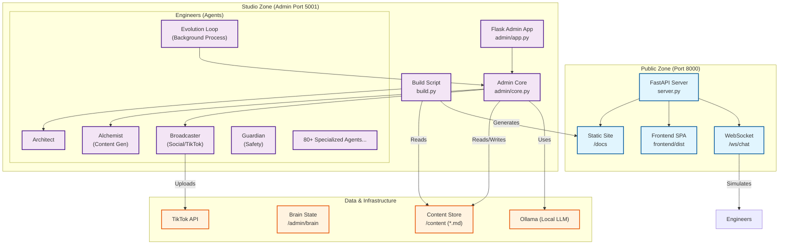

# System Architecture

The "IanSight" System operates as a dual-layer architecture: a **Public Presence** (the website) and a **Private Studio** (the brain/admin system).

## Core Components

### 1. The Public Server (`server.py`)
- **Technology**: FastAPI
- **Port**: 8000
- **Role**: Serves the generated static site (`docs/`) and the client-side application (`frontend/dist`).
- **Features**:
  - WebSockets for "Chat with Team" (`core.team.team_orchestrator`).
  - Public APIs for health checks and inquiry forms.
  - Mobile client support via CORS and asset mounting.

### 2. The Admin Studio (`admin/`)
- **Technology**: Flask (`admin/app.py`) + Custom Python Modules
- **Port**: 5001
- **Role**: The "Mission Control" for managing content, media, and evolution.
- **Key Modules**:
  - **`admin/core.py`**: The central business logic hub. Handles persistence, AI generation pipelines, and server management.
  - **`build.py`**: A custom static site generator. It uses the `Architect` agent to register plugins (like `Guardian`) and processes markdown from `content/` into `docs/`.

### 3. The Federation of Engineers (`admin/engineers/`)
A massive suite of specialized Python classes acting as agents.
- **Architect**: Manages system design and build hooks.
- **Alchemist**: Generates content using LLMs (Ollama/Google).
- **Broadcaster**: Handles video generation and TikTok uploading.
- **Guardian**: Audits content for safety and quality.
- **Evolution Loop**: A background process that continuously "improves" the system.
- **Others**: `VideoEditor`, `SocialEngine`, `Librarian`, `Weaver`, etc.

### 4. Data Flow
1.  **Content Creation**: New content is created manually or via `Alchemist` in `admin/` and saved to `content/` as Markdown.
2.  **Build Process**: `build.py` reads `content/`, applies templates, and generates HTML in `docs/`.
3.  **Deployment**: `server.py` serves the new `docs/`. The `Broadcaster` may automatically generate a video summary and upload it to TikTok.
