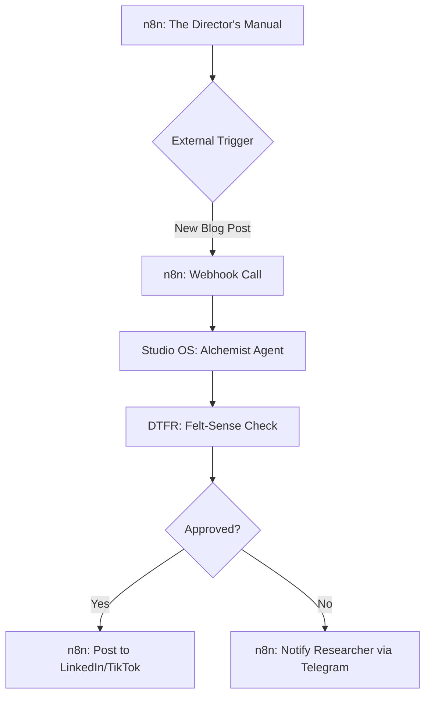

# n8n + Studio OS: The Manager-Worker Orchestration

As we shift from **Typing to Directing**, we need a "Managerial Layer" that handles scheduling, triggers, and multi-step external flows (Discord, Email, LinkedIn). **n8n** excels at this "Visual Workflow" layer, while **Studio OS** provides the "Agentic Depth."

## The Architecture (Hybrid Loop)

## Strategy: Visual vs. Code-Native
- **n8n (Visual)**: Best for status-line updates, cron jobs, and high-level logic (e.g., "If it's Monday, run the Weekly Snapshot").
- **Studio OS (Code-Native)**: Best for deep reasoning, code mutation, and complex content generation where "Felt Quality" is the primary constraint.

## Implementation Pattern
1.  **n8n Webhook Node**: Use the HTTP Request node to call a Flask/FastAPI endpoint on the Studio OS server.
2.  **DTFR Response**: Return the "Felt-Sense Score" and "Assessment" JSON to n8n.
3.  **n8n Conditional**: Route based on the assessment (e.g., "If VPS > 8.0, Publish").

---
*Next Step: Build the `revenue_agent.py` hooks to track ROI of automated posts back into the n8n dashboard.*
