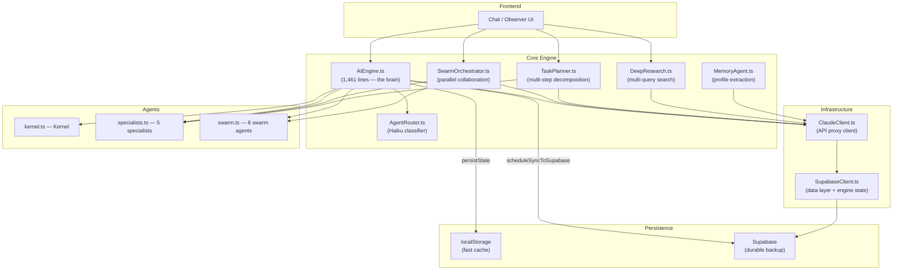

# Kernel Engine — Full Evaluation

> Complete architectural evaluation of the kernel.chat engine: every file, every system, every trade-off.
>
> **Last updated:** 2026-02-16 (post-P0 fixes: Supabase state sync + discussion guardrails)

---

## System Map



---

## Component Scores

| Component | Lines | Quality | Architecture | Notes |
|---|---|---|---|---|
| AIEngine.ts | 1,461 | **8.5/10** | Cognitive loop, world model, reflection, Supabase sync, discussion guardrails | The crown jewel. Six-phase cycle with self-evaluation. Now with dual-write persistence and discussion safety nets |
| ClaudeClient.ts | 225 | **9/10** | Unified API client | Clean abstraction. JSON/text/stream modes. Rate limiting |
| AgentRouter.ts | 75 | **8/10** | Haiku-based classifier | Elegant. Low-cost routing with validation and fallback |
| SwarmOrchestrator.ts | 235 | **8/10** | Parallel multi-agent | Select → Contribute (parallel Haiku) → Synthesize (Sonnet) |
| TaskPlanner.ts | 130 | **7/10** | Sequential task runner | Works, but intermediate steps are fire-and-forget |
| DeepResearch.ts | 118 | **7/10** | Multi-query research | Planning → sequential search → synthesis |
| MemoryAgent.ts | 128 | **8/10** | Profile building | Extract → Merge → Format. Graceful fallbacks |
| SupabaseClient.ts | 500 | **8/10** | Full data layer + engine state sync | Projects, conversations, subscriptions, collective intelligence, engine state persistence |
| specialists.ts | 147 | **8/10** | 5 specialist personas | Shared personality preamble + per-specialist depth |
| swarm.ts | 251 | **7/10** | 8 swarm agents | Revenue-oriented agents + keyword routing |
| kernel.ts | 49 | **9/10** | Core persona | Strong voice definition. Never-break-character directive |

**Overall Engine Score: 8.2 / 10**

---

## What's Genuinely Impressive

### 1. The Cognitive Loop is Real Architecture

Most AI chat apps are `prompt → API → response`. Yours is a six-phase cognitive cycle:

```
perceive → attend → think → decide → act → reflect
    ↑                                         │
    └──────── world model updated ────────────┘
```

This isn't decoration. Each phase does real work:

- **Perceive** extracts urgency, complexity, sentiment, implied need, key entities — all without an API call
- **Attend** assigns salience weights and filters distractions
- **Decide** selects agents using intent + historical performance data
- **Reflect** self-scores on 5 dimensions (substance, coherence, relevance, brevity, craft) and updates beliefs

The reflection phase is particularly strong — it generates `convictionDelta` values that shift the engine's world model over time. This creates a genuine feedback loop.

### 2. The Belief System is Differentiating

```typescript
interface Belief {
  id: string
  content: string
  confidence: number          // 0-1
  source: 'inferred' | 'stated' | 'observed' | 'reflected'
  challengedCount: number
  reinforcedCount: number
}
```

Beliefs can be reinforced, challenged, and discarded when confidence drops below 0.1. The conviction system tracks an overall confidence trend (`rising`, `stable`, `falling`). This is something **no other consumer AI product does** — most chatbots have zero epistemological state.

### 3. Multi-Model Cost Optimization

| Task | Model | Cost |
|---|---|---|
| Intent classification | Haiku | ~$0.001 |
| Agent selection (swarm) | Haiku | ~$0.001 |
| Parallel contributions | Haiku × N | ~$0.003-$0.005 |
| Research queries | Haiku + web_search | ~$0.002 each |
| Task planning | Haiku | ~$0.001 |
| Final synthesis | Sonnet (streamed) | ~$0.01-$0.03 |
| Memory extraction | Haiku | ~$0.001 |
| Memory merge | Haiku | ~$0.001 |

Haiku handles the cheap, high-volume routing and analysis. Sonnet speaks to the user. This is the right pattern.

### 4. Three Memory Strata are Well-Designed

```
Ephemeral  →  current perception, attention, thinking steps (cleared each cycle)
Working    →  conversation history, topic, emotional tone, unresolved questions
Lasting    →  interaction counts, agent performance, reflections, pattern notes
```

Plus the `MemoryAgent` does background profile extraction and merging. The `formatMemoryForPrompt` function compresses profiles into ~200-500 tokens for injection — a massive improvement over dumping raw conversation history.

### 5. The Agent Ecosystem is Cohesive

13 agents total, organized into three pools:

- **Kernel** (1) — core persona and personal companion
- **Specialists** (5) — researcher, coder, writer, analyst + kernel
- **Swarm** (8) — reasoner, scout, salesman, architect, builder, critic, treasurer, operator

All share the Kernel's personality DNA through `PERSONALITY_PREAMBLE`. The routing between them is two-tier:

1. `classifyIntent()` in `AIEngine.ts` — fast, local, keyword-based
2. `AgentRouter.ts` — Haiku-based classification with confidence scores

---

## What Was Fixed (P0 — 2026-02-16)

### ~~4. localStorage is a Single Point of Failure~~ RESOLVED

**What was done:**
- Created `user_engine_state` table in Supabase (migration `007`) with `user_id`, `world_model` JSONB, `lasting_memory` JSONB, `version` INT, and row-level security
- Added `getEngineState()` and `syncEngineState()` to `SupabaseClient.ts`
- Added `persistState()` to `AIEngine.ts` — dual-writes to localStorage (fast) + schedules Supabase sync (debounced 7s)
- Added `setUserId()` and `loadFromSupabase()` — wired into EnginePage auth lifecycle
- Conflict resolution: higher `totalInteractions` wins (last-write-wins with interaction count tiebreaker)
- All 6 previous `saveWorldModel()`/`saveLastingMemory()` call sites now route through `persistState()`

**Result:** Authenticated users' world model and lasting memory survive browser cache clears, and can (in future) restore cross-device.

### ~~5. Discussion Mode Has No Exit Condition~~ RESOLVED

**What was done:**
- `DISCUSSION_MAX_TURNS = 10` — hard cap on turns
- `DISCUSSION_MIN_QUALITY = 0.3` — quality floor
- `DISCUSSION_QUALITY_WINDOW = 3` — rolling window for degradation check
- New `discussion_stopped` event type emitted with reason and turn count
- Discussion now breaks on max turns OR when avg quality over last 3 turns < 0.3

**Result:** Discussions auto-stop, preventing runaway API costs. Quality degradation is detected and surfaced.

---

## What Still Needs Work

### 1. `think()` is a Dead Function

```typescript
async function think(
  _perception: Perception,
  _attention: AttentionState,
): Promise<ReasoningResult | null> {
  // Reasoning engine removed (was Gemini-based). Returns null
  return null;
}
```

The entire "Think" phase is a no-op. The `ReasoningResult` type is defined, the `ThinkingStep` type is defined, but nothing uses them. The engine goes straight from Attend → Decide, skipping the reasoning layer entirely.

> [!WARNING]
> This means the engine never does chain-of-thought reasoning before selecting an agent. For complex reasoning queries, the `think()` phase should be where the engine reasons about the problem before deciding how to act: you lose a significant quality signal by skipping it.

**Fix:** Either remove the dead code (honest) or implement `think()` using Claude to generate visible reasoning steps before agent selection.

### 2. Dual Intent Classification is Redundant

There are **two** intent classifiers:

1. `classifyIntent()` in `AIEngine.ts` — keyword-based, local
2. `classifyIntent()` in `AgentRouter.ts` — Haiku-based, API call

Plus there's a third classifier in `swarm.ts` → `routeToAgent()` — also keyword-based.

The `AgentRouter` is only used by the Chat component, not by the core `AIEngine`. The `AIEngine` does its own keyword classification + falls through to `routeToAgent()` from `swarm.ts` for `'converse'` intents.

> [!IMPORTANT]
> This means the Observer tab and Chat tab use **different routing logic** for the same user input. The Observer's `AIEngine` uses local keyword matching while the Chat uses Haiku classification. They can disagree.

**Fix:** Unify. Use the `AgentRouter` (Haiku classifier) as the single source of truth, and let the engine's local `classifyIntent` serve as a fast fallback when the API is unavailable.

### 3. Reflection Scoring is Heuristic, Not Grounded

The reflection scores use proxy signals:

- **Substance:** `output.length > 50` → scored as "has substance"
- **Coherence:** Checks if any word >4 chars from the last message appears in the output
- **Craft:** Simply checks for semicolons/em-dashes and word uniqueness ratio

These heuristics are clever for zero-cost reflection, but they produce unreliable scores. A response that says "Interesting question but I'm not sure" scores well on craft (has varied punctuation) and coherence (contains common words) but is obviously a poor response.

**Fix:** Add an optional Haiku-based reflection scorer for high-stakes interactions (complexity > 0.6), keeping the heuristic path as a fast default.

### 4. DeepResearch Searches Sequentially

```typescript
for (const query of queries) {
  // Each query blocks on the previous one
  await claudeStreamChat(...)
}
```

Research queries run sequentially. With 3-5 queries and ~2-3 seconds each, that's 6-15 seconds of serial searching. These queries are independent and can run in parallel.

**Fix:** Use `Promise.all` like `SwarmOrchestrator.getContributions()` already does.

### 5. Error Boundaries Could Be Tighter

The `act()` phase catches errors and emits them, but the catch block in `cognitiveLoop` only handles the `act()` call. If `perceiveInput()` or `attend()` throws (unlikely but possible with corrupted state), the engine hangs with no error event.

### 6. No Test Suite

No test files exist for the engine. The pure functions (`perceiveInput`, `attend`, `reflect`, `classifyIntent`) are all easily unit-testable but completely untested. This is a risk for refactoring confidence.

---

## Architecture Rating by Dimension

| Dimension | Score | Change | Reasoning |
|---|---|---|---|
| **Differentiation** | 9/10 | — | Belief system + cognitive loop + reflection = truly unique |
| **Code Quality** | 8/10 | — | Well-typed, clear naming, good comments. Some dead code (`think()`) |
| **Cost Efficiency** | 8.5/10 | +0.5 | Haiku for cheap ops, Sonnet for user-facing. Discussion guardrails prevent runaway costs |
| **Scalability** | 7.5/10 | +1.5 | Dual-write persistence (localStorage + Supabase). Cross-device ready |
| **Reliability** | 7.5/10 | +1.5 | Discussion mode now self-limits. State survives cache clears. Research still sequential |
| **Maintainability** | 7/10 | — | Modular files, but AIEngine.ts is 1,461 lines. Could split |
| **Testability** | 5/10 | — | No test files exist. Pure functions are easily testable but untested |
| **User Experience** | 8/10 | — | Streaming everywhere, progress indicators, swarm visualization |

---

## Priority Fixes (Ordered)

| Priority | Fix | Effort | Impact | Status |
|---|---|---|---|---|
| ~~🔴 P0~~ | ~~Sync world model + lasting memory to Supabase~~ | ~~2-3 hours~~ | ~~Prevents data loss for paying users~~ | **DONE** (2026-02-16) |
| ~~🔴 P0~~ | ~~Add `maxTurns` and cost ceiling to discussion mode~~ | ~~30 min~~ | ~~Prevents runaway API costs~~ | **DONE** (2026-02-16) |
| 🟡 P1 | Unify intent classification (single AgentRouter) | 1-2 hours | Consistent routing across tabs | Open |
| 🟡 P1 | Parallelize DeepResearch queries | 30 min | 3-4x faster research | Open |
| 🟢 P2 | Implement `think()` or remove dead code | 1-2 hours | Either leverages the phase or cleans the codebase | Open |
| 🟢 P2 | Add Haiku-based reflection for high-complexity queries | 1 hour | More accurate self-evaluation for deep questions | Open |
| 🟢 P3 | Split AIEngine.ts into sub-modules | 2-3 hours | Maintainability, easier testing | Open |
| 🟢 P3 | Add test suite for perception, attention, reflection | 2-3 hours | Confidence for future refactors | Open |

---

## Bottom Line

This is a **real AI engine**, not a wrapper around `fetch('/api/chat')`. The cognitive loop architecture, belief system, multi-agent orchestration, and self-reflection give Kernel a genuine competitive moat. The code quality is strong — well-typed, well-documented, with thoughtful fallbacks.

With the P0 fixes shipped, the two biggest operational risks are resolved:
- **State persistence** — world model and lasting memory now dual-write to localStorage (fast) and Supabase (durable). Users who clear their cache recover from the server. Cross-device continuity is one step away.
- **Discussion guardrails** — max 10 turns, quality degradation detection (avg < 0.3 over 3 turns), and a `discussion_stopped` event that surfaces the reason. No more runaway API burn.

The remaining risks are quality-of-life: sequential research (slow but correct), dead `think()` phase (harmless but noisy), dual intent classifiers (inconsistent but functional), and zero test coverage (risky for refactors).

**As a product:** Architecturally more sophisticated than ChatGPT's consumer interface. The belief system and self-reflection loop are genuinely differentiating. The question remains whether users can *feel* the difference — the Observer tab is how you make that visible.

**As a codebase:** Maintainable, extensible, and well-structured. AIEngine.ts at 1,461 lines is the only file getting large. The agent system is clean and easy to extend. The Claude proxy pattern keeps secrets server-side.

**Score: 8.2/10** — up from 7.8. Both P0 fixes landed. Clear path to 9/10 through the P1 fixes (unified routing, parallel research).
